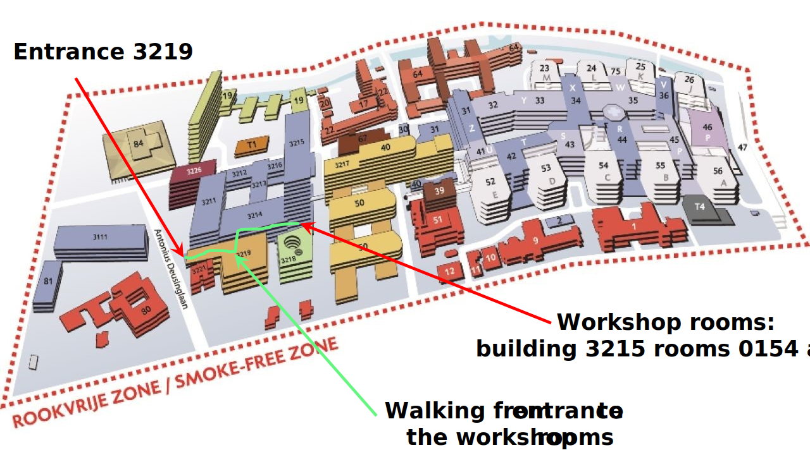
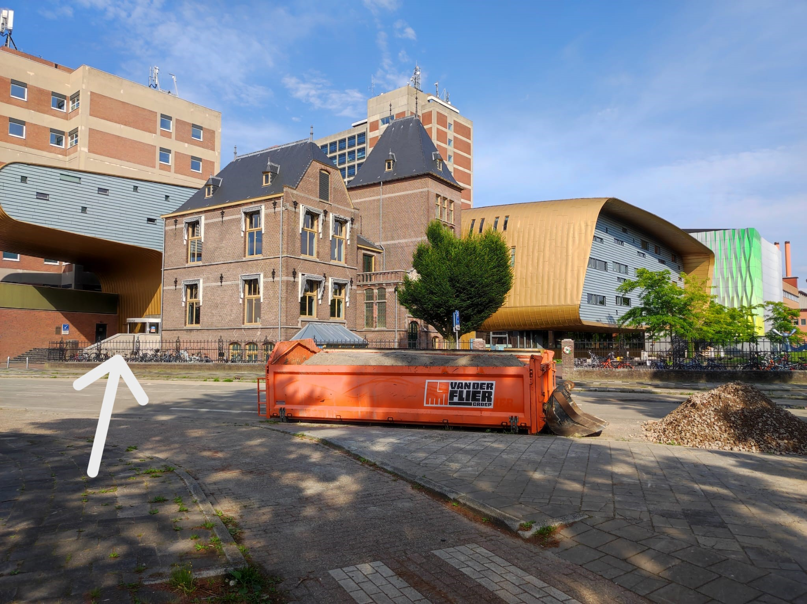
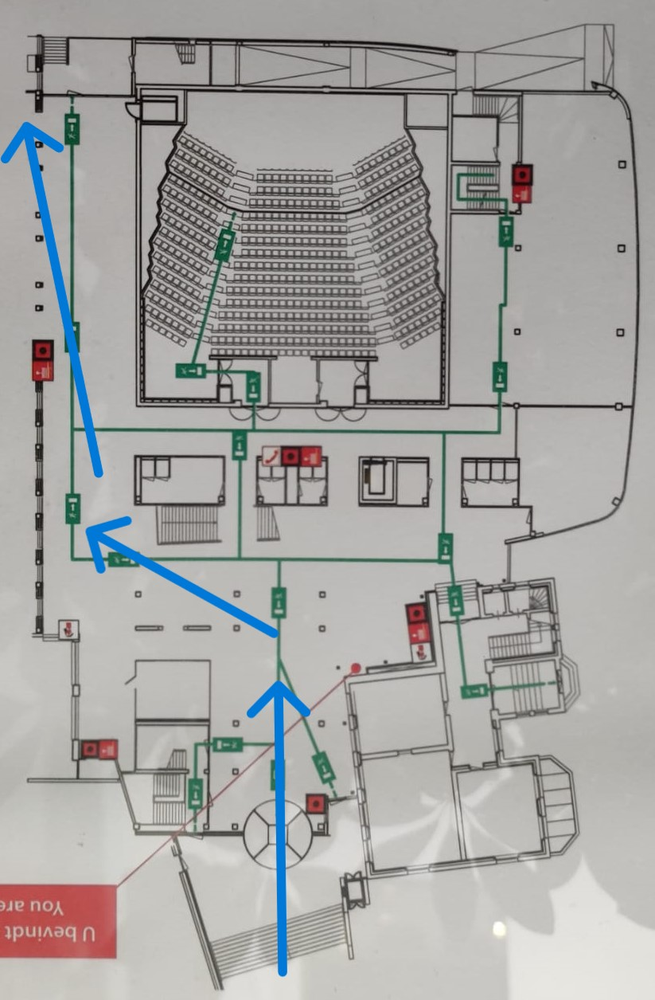
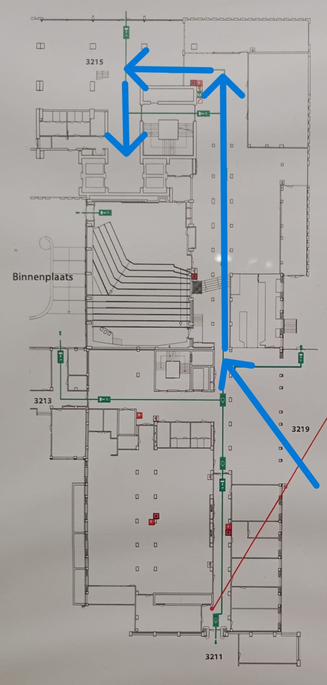
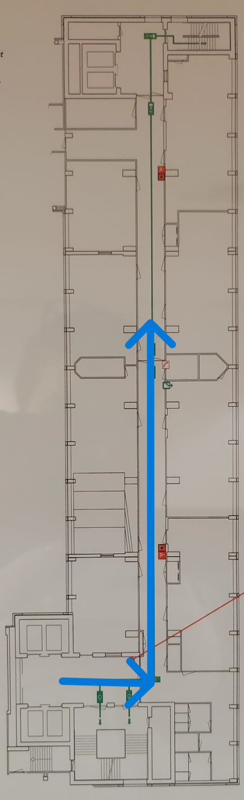
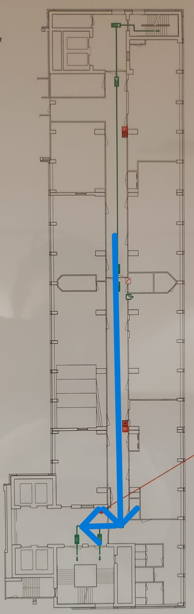
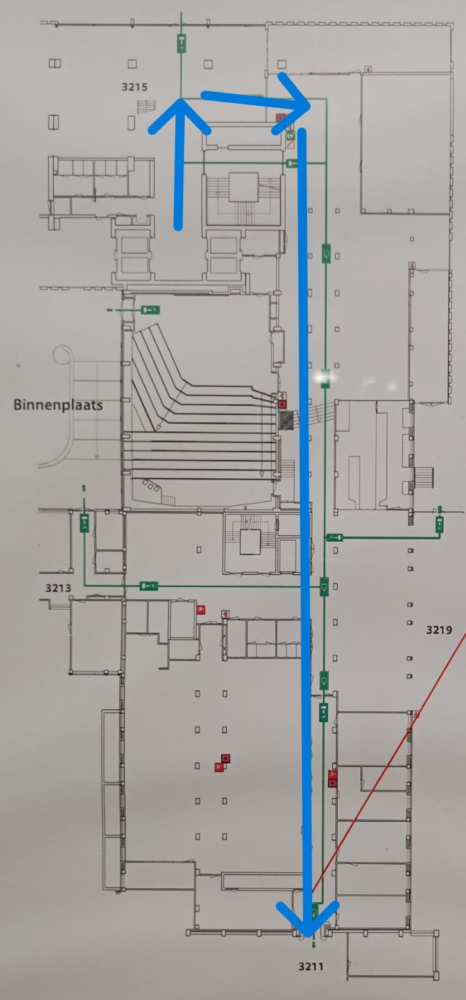
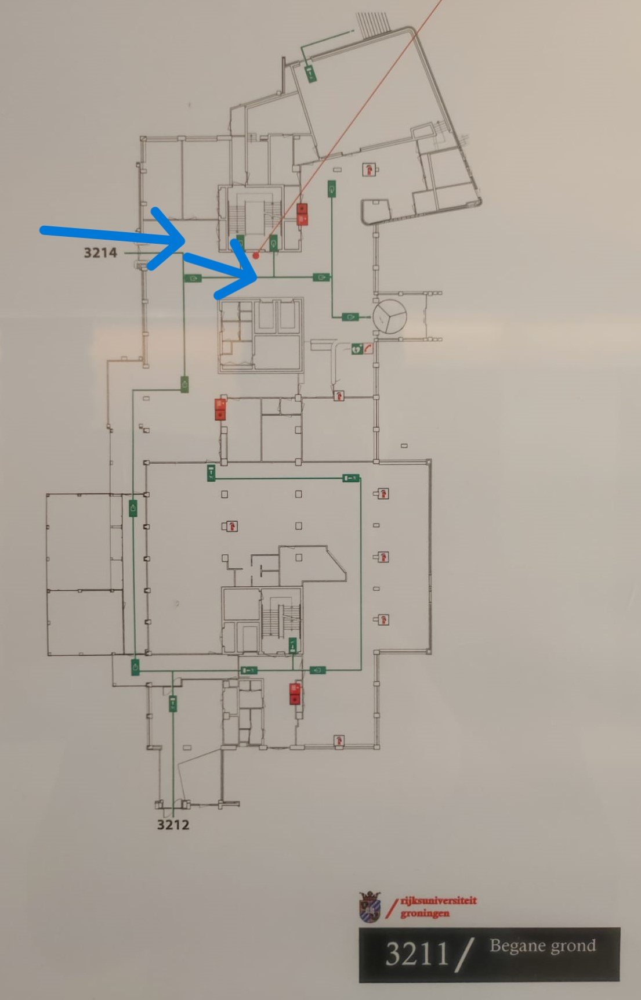
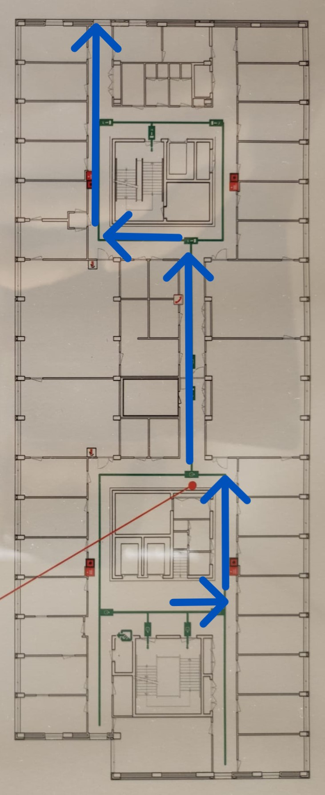
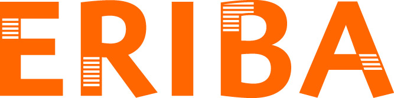

#  Proteogenomics workshop 2024, July 16 and 17 2024
**Workshop on “Protein variant detection with proteogenomics data integration”**  
University of Groningen, July 16 and 17 2024

# Program July 16, 2024
Location: 3215.0154 (RUG building 3215, 1st floor, room 0154) 
08.30 - 08.50 *Welcome & coffee* (3215.0154)  
08.50 - 09.00 **Opening and presentation of the program** (Peter Horvatovich) 
09.00 - 10.30 **Introduction in proteogenomics, Quilts and PGx** (David Fenyo) 
10.30 - 10.45 *Coffee break* (3215.0154) 
10.45 - 12.15 **Pitfalls and challenges in proteogenomics analysis** (David Tabb) 
12.15 - 13.15 *Lunch onsite* (Eriba 6th floor [building 3226] Lounge area) 
13.15 - 14.45 **Protein variant detection with Groningen Proteogenomics Workflow** (Peter Horvatovich, Victor Guryev) 
14.45 - 15.00 *Coffee break* (3215.0154) 
15.00 - 18.00 **Hands on tutorial with Quilts and PGx** (David Fenyo) [link to tutorials: [QUILTS & PGx](https://github.com/horvatovichlab/Proteogenomics_workshop_2024/tree/main/QUILTS%20%26%20PGx)] 
18.30 - 20.30 *Dinner with all participants* (Restaurant Rabenhaupt, [Gedempte Zuiderdiep 7, 9711 HA Groningen](https://www.google.com/maps/place/Rabenhaupt+%7C+Ontzettende+Held+In+Eten+En+Drinken!/@53.215863,6.570315,17z/data=!3m1!4b1!4m6!3m5!1s0x47c9cd5697e9b26b:0x3bdc65f3c8ad3f88!8m2!3d53.215863!4d6.570315!16s%2Fg%2F11c53bkz_s?entry=ttu)) 

# Program July 17, 2024
Location: 3215.0149 (RUG building 3215, 1st floor, room 149, **Across the hall from the yesterday's room**) 
09.00 - 12.00 **Proteogenomics analysis with fragpipe** (David Tabb) 
12.00 - 13.00 *Lunch onsite* (Eriba 6th floor [building 3226] Lounge area) 
13.00 - 16.00 **Hands on proteogenomics tutorial with GPW** (Peter Horvatovich, Victor Guryev) 
16.00 - 16.15 *Coffee break* (3215.0149) 
16.15 - 17.15 **Evaluation and discussion with the participants**  
17.15 - 17.25 **Closing remarks** (Victor Guryev) 
18:00 - 21:00 Speakers dinner (Restaurant Prinsenhod Brasserie, [Martinikerkhof 23, 9712 JH Groningen](https://www.google.com/maps/place/Brasserie+Prinsenhof/@53.2209054,6.5690646,17z/data=!3m1!4b1!4m6!3m5!1s0x47c9cdebdb5de437:0x27931600f7eb6b0c!8m2!3d53.2209054!4d6.5690646!16s%2Fg%2F11fnqk813b?entry=ttu))

**Note to participants**: please bring your laptop, and if possible pre-Install 'WSL' (Windows Subsystem for Linux) and/or a ssh client (e.g. Bitwise). We are working on providing VMs, and will provide additional details during the workshop. Laptops with at least 20GB of RAM as well as 50 - 150 GB of free disk space may be used to try to follow along the tutorial. For those who have such a laptop, you will need: WSL, git, python >= 3.11, vscode, java OpenJDK (>=17), nextflow, docker, apptainer, gdown.

The workshop data can be found in the [Google drive folder](https://drive.google.com/drive/u/0/folders/1HqoZoEH5d1pY8_VrVinobYWWcvZ3RqP2).

## Aims of the workshop is to present proteogenomics data integration and software tools
Protein variants play an essential role either as molecular drivers or as risk factors in development of mendelian and complex diseases such as COPD or cancer. Genomics and transcriptomic data can be used to predict protein variants however these predictions often include variants which are translated at low levels, or not at all. Confidently identifying protein variants solely from LC MS/MS proteomics data is challenging due to the stochastic nature of fragment mass spectra used for peptide identification. Those same factors often prevent *de novo* identification. Proteogenomics data integration uses genomics or transcriptomics based protein sequence predictions (from the same samples) to expand the targeted database used when searching high throughput LC MS/MS data. Such proteogenomics approaches can be used to identify key somatic mutated driver genes in cancer, or identify germline variants in protein coding regions that are important risk factors to develop complex diseases.

## Content of the workshop
The aim of this workshop is to provide an overview on proteogenomics data integration tools allowing to identify protein variants from LC MS/MS using predicted protein variants from genomic or transcriptomics data obtained from the same sample. The workshop will present theory and tutorial on Quilts, PGx tools developed by David Fenyo laboratory (New York University), Groningen Proteogenomics Workflow (developed at University of Groningen as part of X-Omics consortium (Peter Horvatovich, Victor Guryev and Yanick Hagemeijer) and the proteogenomics data integration workflow developed by David Tabb (University of Groningen).

## Venue
UMCG North, University of Groningen, Groningen, Antonious Deusinglaan 1 9713 AV.

Location to enter UMCG north complex ([Antonius Deusinglaan 1, 9713AV, Groningen](https://maps.app.goo.gl/7DMWXrjDfUN1epH99)) and walking route to Workshop rooms:

**Route descriptions** 
* *From entrance Antinius Deusinglaan 1 to the Workshop rooms*: When approaching from the bus stop 'UMCG noord' (UMCG North), we recommend entering through the revolving doors of the yellow building (building 3219), then walk along the sitting area (building 3214), follow the sign to the restaurant (walk by the espressobar), down the steps and carry on straight (towards building 3215) at the end of the hallway you can either go through the door on your left and and walk up the stairs or walk around the staircase to use one of the elevators. Go to the 1st floor. Walk about 2/3rds down the only hallway until you find find the rooms labeled 149 and 154 (full room numbers for if you get lost 3215.0154 and 3215.0149). See below for visual instructions:

* *From the Workshop rooms to the lunch location (Eriba 6th floor Lounge area)*: Go back the way you came to the ground floor. Walk by the restaurant, up the stairs, and straight across into the a hallway. When you get to a bigger open space you will find the elevator and stairwell in at your 1'o clock. Go to the 6th floor. Follow the signs with arrows for 'Virologie & Immunologie research', take the left hallway on the T-junction, around the corner you will see a grey door at the end of the hallway, go through (push it to open if it is closed, it should be unlocked) to reach the 6th floor Lounge area. See below for visual instructions:

## Key lecturers and tutors
David Fenyo (University of New York), David Tabb (University of Groningen), Peter Horvatovich (University of Groningen), Victor Guryev (University of Groningen), Yanick Hagemeijer (University of Groningen), Kristoffer Basse (University of Groningen) and Bea Szeitz (Korányi Institute).

In case of questions or emergency call or email:
* Peter Horvatovich  (+31 6 2459 7203, p.l.horvatovich@rug.nl)
* Jolanda Meiderstma (+31 50 363 3336, j.meindertsma@rug.nl)

## Course fee, travel and accommodation
Attendance to the course is free, but travel and accommodation expenses should be covered by the participants Recommended accommodations are:
* The Social Hub Groningen ([Boterdiep 9 9712 LH Groningen](https://www.thesocialhub.co/groningen/?utm_source=googlemybusiness&utm_medium=organic&y_source=1_Mjc4NzI2MDUtNzE1LWxvY2F0aW9uLndlYnNpdGU%3D))
* Hotel NH Groningen ([Hanzeplein 132 9713 GW Groningen](https://www.nh-hotels.com/en/hotel/nh-groningen?utm_campaign=local-gmb&utm_medium=organic_search&utm_source=google_gmb)).

&emsp;
&emsp;
&emsp;

