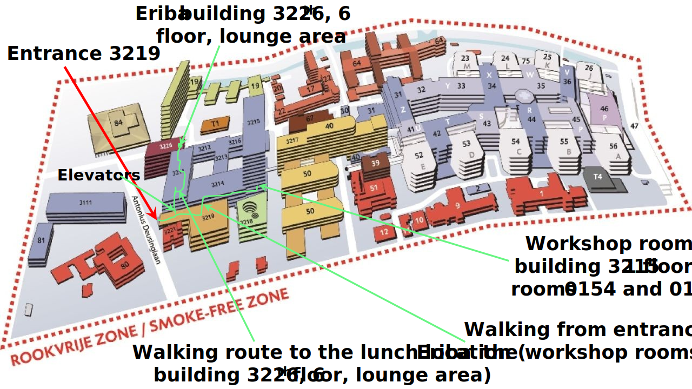

#  Proteogenomics workshop 2024, July 16 and 17, 2024
**Workshop on “Protein variant detection with proteogenomics data integration”** 
University of Groningen, July 16 and 17, 2024

# Program day 1
*July 16, 2024 Location 3215.0154* 
08.30 - 08.50 *Welcome & coffee* (Eriba 6th floor [building 3226] Lounge area)  
08.50 - 09.00 **Opening and presentation of the program** (Peter Horvatovich) 
09.00 - 10.30 **Introduction in proteogenomics,Quilts** and PGx (David Fenyo) 
10.30 - 10.45 *Coffee break* (Eriba 6th floor [building 3226] Lounge area) 
10.45 - 12.15 **Pitfalls and challenges in proteogenomics analysis** (David Tabb) 
12.15 - 13.15 *Lunch onsite* (Eriba 6th floor [building 3226] Lounge area) 
13.15 - 14.45 **Protein variant detection with Groningen Proteogenomics Workflow** (Peter Horvatovich, Victor Guryev) 
14.45 - 15.00 *Coffee break* (Eriba 6th floor [building 3226] Lounge area) 
15.00 - 18.00 **Hands on tutorial with Quilts and PGx** (David Fenyo) 
18.30 - 20.30 *Dinner with all participants* (Restaurant Rabenhaupt, [Gedempte Zuiderdiep 7, 9711 HA Groningen](https://www.google.com/maps/place/Rabenhaupt+%7C+Ontzettende+Held+In+Eten+En+Drinken!/@53.215863,6.570315,17z/data=!3m1!4b1!4m6!3m5!1s0x47c9cd5697e9b26b:0x3bdc65f3c8ad3f88!8m2!3d53.215863!4d6.570315!16s%2Fg%2F11c53bkz_s?entry=ttu)) 

# Program day 2
*July 17, 2024 Location 3215.0149* 
09.00 - 12.00 **Proteogenomics analysis with fragpipe** (David Tabb) 
12.00 - 13.00 *Lunch onsite* (Eriba 6th floor [building 3226] Lounge area) 
13.00 - 16.00 **Hands on proteogenomics tutorial with GPW** (Peter Horvatovich, Victor Guryev) 
16.00 - 16.15 *Coffee break* (Eriba 6th floor [building 3226] Lounge area) 
16.15 - 17.15 **Evaluation and discussion with the participants** 
17.15 - 17.25 **Closing remarks** (Victor Guryev) 
18:00 - 21:00 Speakers dinner (Restaurant Prinsenhod Brasserie, [Martinikerkhof 23, 9712 JH Groningen](https://www.google.com/maps/place/Brasserie+Prinsenhof/@53.2209054,6.5690646,17z/data=!3m1!4b1!4m6!3m5!1s0x47c9cdebdb5de437:0x27931600f7eb6b0c!8m2!3d53.2209054!4d6.5690646!16s%2Fg%2F11fnqk813b?entry=ttu))

**Note to participants**: please bring your laptop (would be great to have at least 16GB RAM, >4 cores and 100 GB disk space). Install WSL (Windows Subsystem for Linux) and/or ssh client (e.g. Bitwise). We are working on providig VMs, but participants with specification above may try to follow the tutorial on their on laptop. WSL should include python (>3.11) and preferabely latest vscode, java OpenJDK (>17), nextflow, docker, apptainer.

Training data is accessible at open [Google drive folder](https://drive.google.com/drive/u/0/folders/1HqoZoEH5d1pY8_VrVinobYWWcvZ3RqP2).

Location to enter UMCG north complex ([Antinious Deusinglaan 1, 9713AV, Groningen](https://www.google.com/maps/place/UMCG%2FMedische+Faculteit/@53.2241551,6.5703908,97m/data=!3m1!1e3!4m6!3m5!1s0x47c9cd8b194078a9:0x999e4ca859cf64ff!8m2!3d53.2241143!4d6.5706481!16s%2Fg%2F11vctwm6ws?entry=ttu)) and walking route to Workshop rooms:

**Route descriptions** 
* *From entrance Antinius Deusinglaan 1 to the Workshop rooms*: To enter the building complex of UMCG North, we recommend from building 3216 (yellow building), then go to building 3211 and then to 3215 at the ground-floor. In 3215 there is a staircase and multiple elevators, which you can use to reach the 1 floor where you can found the rooms 3215.0154 and 3215.0149.
* *From the Workshop rooms to lunch location (Eriba 6th loor Lounge area)*: you can go down to the ground-floor or to the 2nd floor, then head to building 3211 where there are two elevators. Go then to 6th floor and go to the north-east side of the building, where you will find a large grey door written "Analytical Biochemistry". Push this door and you will enter the Eriba 6th loor Lounge area.

In case of questions or emergency call or email to Peter Horvatovich (+31 6 2459 7203, p.l.horvatovich@rug.nl) or Jolanda Meiderstma (+31 50 363 3336, (j.meindertsma@rug.nl).

## Aims of the workshop is to present proteogenomics data integration and software tools
Protein variants play an essential role either as molecular drivers or as risk factors in development of one gene driven or complex diseases such as COPD or cancer Genomics and transcriptomic data can be used to predict protein variants however they often predict too many variants which are not translated or are translated at low levels to proteins Identification of protein variants exclusively from LC MS/MS proteomics data is challenging due to the stochastic nature of fragment mass spectra used for peptide identification which often prevent de novo identification Proteogenomics data integration aims to use predicted protein sequence from genomic or transcriptomics data obtained from the same samples and use the predicted sequence in targeted database search of high throughput LC MS/MS data Proteogenomics approach has been used to identify key somatic driver genes in cancer or identify protein germline variants that are important risk factors to develop complex diseases.

## Content of the workshop
The aim of this workshop is to provide an overview on proteogenomics data integration tools allowing to identify protein variants from LC MS/MS using predicted protein variants from genomic or transcriptomics data obtained from the same sample The workshop will present theory and tutorial on Quilts, PGx tools developed by David Fenyo laboratory (New York University), Groningen Proteogenomics Workflow (developed at University of Groningen as part of X Omics consortium (Peter Horvatovich, Victor Guryev and Yanick Hagemeijer) and the proteogenomics data integration workflow developed by David Tabb.

&emsp;
&emsp;
&emsp;

